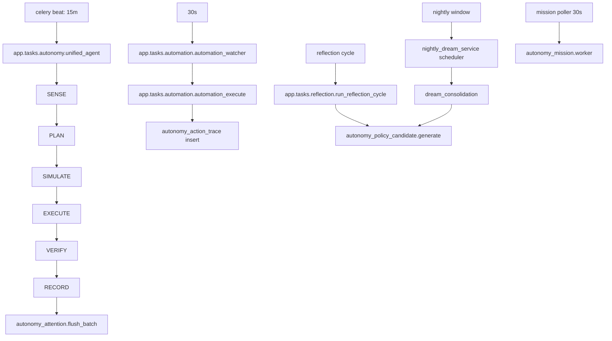

# Jarvis Cortana Evolution Specification

Status: Proposed  
Scope: Single-user deployment (David only)  
Primary codebase: `backend/app` + `frontend` + `ios-app` + `sara-desktop`

## 1. Executive Summary

Sara already has strong capabilities across chat, memory, home automation, habits, and background workers. To make Sara feel more like Jarvis/Cortana, the key change is not adding random features. The key change is introducing a clear control plane that decides:

1. What matters now.
2. What should be done now versus deferred.
3. What actions are safe to execute automatically.
4. How to keep continuity across chat, mobile, desktop, and home state.

This spec defines the implementation path with:

1. Exact schema changes.
2. API contracts.
3. Celery task graph and queue assignment.
4. Phased rollout and migration checklist.

## 2. Product Target

Sara should behave like an ambient operator:

1. Continuously aware, without being noisy.
2. Proactive with high precision, low spam.
3. Action-capable with auditability and safety tiers.
4. Memory-driven follow-through on commitments.
5. Cross-device continuity (chat, iOS, desktop, home automations).

## 3. Current Feature Surface and Upgrade Direction

| Domain | Current Implementation | Upgrade for Jarvis/Cortana |
|---|---|---|
| Heartbeat autonomy | `backend/app/services/unified_agent.py` | Add deterministic planner and action simulation before execution |
| Standing orders | `backend/app/services/standing_order_service.py` | Add confidence, policy tuning, explicit conflict governance |
| Automations | `backend/app/tasks/automation.py`, `backend/app/tools/automation.py` | Keep deterministic executor role only, no policy inference |
| Reflection and dream | `backend/app/tasks/reflection.py`, `backend/app/services/nightly_dream_service.py`, `backend/app/services/dream_consolidation.py` | Convert outputs into next-day operating context and policy candidates |
| Notifications | `backend/app/services/unified_notification.py` | Move to inbox-first proactive flow, push only urgent/high-confidence |
| Memory recall | `backend/app/services/memory_service.py`, `backend/app/services/agent_memory.py` | Add operator memory classes: commitments/open loops/watchlist |
| PKG and graph | `backend/app/services/personal_knowledge_graph.py`, `backend/app/routes/knowledge_graph.py` | Promote graph deltas into actions/suggestions |
| Device and home control | `backend/app/services/ha_control_service.py`, `backend/app/routes/device_commands.py` | Add risk-tier policy and simulation gate |
| Research/orchestration | `backend/app/routes/orchestrator.py`, `backend/app/routes/research.py` | Unify as mission state machine with audit trail |
| UI surfaces | `frontend`, `ios-app`, `sara-desktop` | Shared continuity model (active mission, watchlist, pending actions) |

## 4. Target Runtime Architecture

## 4.1 Control Plane Components

Add these core services:

1. `AutonomyStateMachine`  
File: `backend/app/services/autonomy/state_machine.py`  
Purpose: Canonical cycle `SENSE -> PLAN -> SIMULATE -> EXECUTE -> VERIFY -> RECORD`.

2. `ActionPolicyEngine`  
File: `backend/app/services/autonomy/policy_engine.py`  
Purpose: Risk-tier evaluation and allow/deny/defer decisions.

3. `AttentionQueueService`  
File: `backend/app/services/autonomy/attention_queue.py`  
Purpose: Unified proactive inbox item creation, dedupe, and delivery policy.

4. `MissionEngine`  
File: `backend/app/services/autonomy/mission_engine.py`  
Purpose: Long-running tasks with resumability and confirmations.

5. `ActionSimulator`  
File: `backend/app/services/autonomy/action_simulator.py`  
Purpose: Dry-run validation and preconditions check for actionable plans.

## 4.2 Heartbeat Integration

Keep `backend/app/services/unified_agent.py` as orchestrator entrypoint, but make behavior:

1. `SENSE`: gather current state.
2. `PLAN`: deterministic planner output (structured JSON plan).
3. `SIMULATE`: validate planned actions.
4. `EXECUTE`: run only allowed actions.
5. `VERIFY`: check postconditions.
6. `RECORD`: write run log, action trace, attention queue updates.

LLM remains important for synthesis and decision support, but execution is gated by deterministic policy and simulator outcomes.

## 5. Data Model Changes (Exact Schema)

Note: Use `TEXT` for `user_id` to match current `app_user.id` usage in the codebase.

## 5.1 New Tables

```sql
CREATE TABLE IF NOT EXISTS autonomy_attention_item (
    id UUID PRIMARY KEY,
    user_id TEXT NOT NULL REFERENCES app_user(id) ON DELETE CASCADE,
    source VARCHAR(64) NOT NULL,
    category VARCHAR(32) NOT NULL, -- insight, alert, reminder, followup, mission
    priority VARCHAR(16) NOT NULL DEFAULT 'normal', -- low, normal, high, urgent
    title VARCHAR(255) NOT NULL,
    message TEXT NOT NULL,
    dedupe_key VARCHAR(255),
    status VARCHAR(16) NOT NULL DEFAULT 'new', -- new, sent, read, archived, dropped
    payload JSONB NOT NULL DEFAULT '{}'::jsonb,
    created_at TIMESTAMPTZ NOT NULL DEFAULT NOW(),
    sent_at TIMESTAMPTZ,
    read_at TIMESTAMPTZ,
    archived_at TIMESTAMPTZ
);

CREATE UNIQUE INDEX IF NOT EXISTS idx_attention_dedupe_active
ON autonomy_attention_item(user_id, dedupe_key)
WHERE dedupe_key IS NOT NULL AND status IN ('new', 'sent');

CREATE INDEX IF NOT EXISTS idx_attention_user_status_created
ON autonomy_attention_item(user_id, status, created_at DESC);
```

```sql
CREATE TABLE IF NOT EXISTS autonomy_mission (
    id UUID PRIMARY KEY,
    user_id TEXT NOT NULL REFERENCES app_user(id) ON DELETE CASCADE,
    kind VARCHAR(32) NOT NULL, -- research, summarize, compare, monitor, workflow
    title VARCHAR(255) NOT NULL,
    description TEXT,
    state VARCHAR(24) NOT NULL DEFAULT 'queued', -- queued, running, waiting_confirm, done, failed, cancelled
    priority INTEGER NOT NULL DEFAULT 5,
    risk_tier SMALLINT NOT NULL DEFAULT 0,
    input JSONB NOT NULL DEFAULT '{}'::jsonb,
    output JSONB NOT NULL DEFAULT '{}'::jsonb,
    progress INTEGER NOT NULL DEFAULT 0,
    created_by VARCHAR(32) NOT NULL DEFAULT 'sara', -- sara, user, system
    created_at TIMESTAMPTZ NOT NULL DEFAULT NOW(),
    started_at TIMESTAMPTZ,
    completed_at TIMESTAMPTZ,
    updated_at TIMESTAMPTZ NOT NULL DEFAULT NOW(),
    error_message TEXT
);

CREATE INDEX IF NOT EXISTS idx_mission_user_state_updated
ON autonomy_mission(user_id, state, updated_at DESC);
```

```sql
CREATE TABLE IF NOT EXISTS autonomy_mission_step (
    id BIGSERIAL PRIMARY KEY,
    mission_id UUID NOT NULL REFERENCES autonomy_mission(id) ON DELETE CASCADE,
    step_index INTEGER NOT NULL,
    tool_name VARCHAR(64) NOT NULL,
    args JSONB NOT NULL DEFAULT '{}'::jsonb,
    result JSONB NOT NULL DEFAULT '{}'::jsonb,
    status VARCHAR(16) NOT NULL DEFAULT 'pending', -- pending, running, success, failed, skipped
    started_at TIMESTAMPTZ,
    finished_at TIMESTAMPTZ
);

CREATE UNIQUE INDEX IF NOT EXISTS idx_mission_step_unique
ON autonomy_mission_step(mission_id, step_index);
```

```sql
CREATE TABLE IF NOT EXISTS autonomy_action_trace (
    id BIGSERIAL PRIMARY KEY,
    user_id TEXT NOT NULL REFERENCES app_user(id) ON DELETE CASCADE,
    run_id INTEGER REFERENCES agent_run_log(id) ON DELETE SET NULL,
    source VARCHAR(64) NOT NULL, -- heartbeat, standing_order, automation, mission
    action_name VARCHAR(64) NOT NULL,
    risk_tier SMALLINT NOT NULL DEFAULT 0,
    decision VARCHAR(16) NOT NULL, -- allow, deny, defer
    decision_reason TEXT,
    simulation JSONB NOT NULL DEFAULT '{}'::jsonb,
    request JSONB NOT NULL DEFAULT '{}'::jsonb,
    response JSONB NOT NULL DEFAULT '{}'::jsonb,
    success BOOLEAN,
    created_at TIMESTAMPTZ NOT NULL DEFAULT NOW()
);

CREATE INDEX IF NOT EXISTS idx_action_trace_user_created
ON autonomy_action_trace(user_id, created_at DESC);
```

```sql
CREATE TABLE IF NOT EXISTS autonomy_policy_candidate (
    id UUID PRIMARY KEY,
    user_id TEXT NOT NULL REFERENCES app_user(id) ON DELETE CASCADE,
    source VARCHAR(64) NOT NULL, -- reflection, dream, behavior_pattern
    candidate_type VARCHAR(32) NOT NULL, -- standing_order, automation, reminder_rule
    title VARCHAR(255) NOT NULL,
    description TEXT NOT NULL,
    payload JSONB NOT NULL DEFAULT '{}'::jsonb,
    confidence REAL NOT NULL DEFAULT 0.0,
    status VARCHAR(16) NOT NULL DEFAULT 'new', -- new, accepted, rejected, expired
    created_at TIMESTAMPTZ NOT NULL DEFAULT NOW(),
    decided_at TIMESTAMPTZ
);

CREATE INDEX IF NOT EXISTS idx_policy_candidate_user_status
ON autonomy_policy_candidate(user_id, status, created_at DESC);
```

## 5.2 Existing Table Extensions

```sql
ALTER TABLE agent_run_log
ADD COLUMN IF NOT EXISTS plan_summary JSONB DEFAULT '{}'::jsonb,
ADD COLUMN IF NOT EXISTS execution_summary JSONB DEFAULT '{}'::jsonb,
ADD COLUMN IF NOT EXISTS quiet_mode_active BOOLEAN DEFAULT FALSE;
```

```sql
ALTER TABLE standing_order
ADD COLUMN IF NOT EXISTS confidence REAL DEFAULT 0.7,
ADD COLUMN IF NOT EXISTS risk_tier SMALLINT DEFAULT 1,
ADD COLUMN IF NOT EXISTS auto_pause_reason TEXT,
ADD COLUMN IF NOT EXISTS last_conflict_at TIMESTAMPTZ;
```

```sql
ALTER TABLE automation_task
ADD COLUMN IF NOT EXISTS origin VARCHAR(32) DEFAULT 'user',
ADD COLUMN IF NOT EXISTS risk_tier SMALLINT DEFAULT 1,
ADD COLUMN IF NOT EXISTS requires_confirmation BOOLEAN DEFAULT FALSE;
```

```sql
ALTER TABLE notification_log
ADD COLUMN IF NOT EXISTS attention_item_id UUID REFERENCES autonomy_attention_item(id) ON DELETE SET NULL;
```

## 6. API Contracts

## 6.1 Attention Queue

New route file: `backend/app/routes/autonomy_attention.py`

1. `GET /autonomy/attention`
- Query: `status`, `category`, `limit`, `offset`
- Response:
```json
{
  "items": [
    {
      "id": "uuid",
      "category": "alert",
      "priority": "high",
      "title": "Front door unlocked",
      "message": "Unlocked for 12 minutes",
      "status": "new",
      "created_at": "2026-02-10T18:05:00Z",
      "payload": {}
    }
  ],
  "total": 12
}
```

2. `POST /autonomy/attention/{id}/read`
- Marks item read.

3. `POST /autonomy/attention/{id}/archive`
- Archives item.

## 6.2 Mission API

New route file: `backend/app/routes/autonomy_missions.py`

1. `POST /autonomy/missions`
- Request:
```json
{
  "kind": "research",
  "title": "Compare two thermostat schedules",
  "description": "Find lower-cost option",
  "priority": 4,
  "risk_tier": 1,
  "input": {"sources": ["calendar", "energy_usage"]}
}
```
- Response: mission object with `state=queued`.

2. `GET /autonomy/missions`
- Query: `state`, `kind`, `limit`.

3. `GET /autonomy/missions/{id}`
- Includes steps, progress, and output.

4. `POST /autonomy/missions/{id}/cancel`
- Transitions mission to `cancelled` if allowed.

5. `POST /autonomy/missions/{id}/confirm`
- Used when mission is in `waiting_confirm`.

## 6.3 Policy Candidate API

New route file: `backend/app/routes/autonomy_policy_candidates.py`

1. `GET /autonomy/policy-candidates`
- Returns pending candidates.

2. `POST /autonomy/policy-candidates/{id}/accept`
- Converts candidate into standing order or automation.

3. `POST /autonomy/policy-candidates/{id}/reject`
- Marks candidate rejected.

## 6.4 Action Simulation API

New route file: `backend/app/routes/autonomy_simulation.py`

1. `POST /autonomy/simulate`
- Request:
```json
{
  "action_name": "home_climate_set",
  "risk_tier": 1,
  "request": {"entity_id": "climate.downstairs", "temperature": 68}
}
```
- Response:
```json
{
  "decision": "allow",
  "reason": "safe bounds and entity reachable",
  "checks": [{"name":"entity_exists","ok":true},{"name":"temp_bounds","ok":true}]
}
```

## 7. Celery Task Graph and Queue Assignment

## 7.1 Proposed Task Graph



## 7.2 Queue Mapping

| Queue | Tasks |
|---|---|
| `cognitive` | `autonomy.unified_agent`, `automation.*`, mission workers, content/research tasks |
| `reflection` | `reflection.*`, policy candidate generation |
| `maintenance` | cleanup, scoring, backfills |
| `low_priority` | daily digests, batch attention flush, non-urgent summaries |
| `health` | health monitor and body-state jobs |
| `input` | ingestion and input preprocessing |

## 7.3 Queue Topology Enforcement

1. Keep runtime validation in `backend/app/celery_app.py`.
2. Keep deploy-time script `scripts/validate_queue_topology.sh`.
3. Keep `CELERY_WORKER_QUEUES` aligned in compose/env.

## 8. Implementation Plan by Feature Domain

## 8.1 Chat and Tooling

1. Add plan object generation in `backend/app/services/unified_agent.py`.
2. Persist planned actions to `agent_run_log.plan_summary`.
3. Route proactive outputs to `autonomy_attention_item` first.

## 8.2 Memory and Continuity

1. Extend `backend/app/services/context_builder.py` to inject:
- open commitments
- unresolved follow-ups
- active mission summaries
2. Add retrieval slices for "operator memory" in `backend/app/services/agent_memory.py`.

## 8.3 Standing Orders and Automations

1. Keep standing orders as policy and contextual layer.
2. Keep automations as deterministic schedule layer.
3. Add conversion workflow from accepted policy candidates.

## 8.4 Reflection and Dream

1. Reflection and dream tasks create structured policy candidates.
2. Candidates require explicit accept/reject unless risk tier is zero and explicitly allowlisted.

## 8.5 Notification and Inbox UX

1. Attention queue becomes default for non-urgent output.
2. Push notifications remain for urgent/high-priority only.
3. Frontend, iOS, and desktop show same queue state.

## 8.6 Device and Home Control

1. Add risk-tier matrix:
- Tier 0 read-only
- Tier 1 reversible actions
- Tier 2 irreversible/high-impact actions
2. Tier 2 requires explicit confirm or allowlist standing order.

## 8.7 Mission Engine

1. Unify orchestrator/research/background jobs into `autonomy_mission`.
2. Show mission progress and pending confirmations in all clients.

## 9. Rollout Plan

## Phase 0: Baseline Hardening (Week 1)

1. Stabilize autonomy correctness (quiet mode, queue topology, status vocab).
2. Add initial action trace writes.
3. Success criteria: no duplicated actions, no missing run logs.

## Phase 1: Control Plane Core (Weeks 2-3)

1. Implement `AutonomyStateMachine`, `ActionPolicyEngine`, `ActionSimulator`.
2. Add schema migrations in Section 5.
3. Success criteria: heartbeat executes through planner/simulator path.

## Phase 2: Attention Queue + Mission Engine (Weeks 4-5)

1. Add attention queue routes and UI surfaces.
2. Add mission routes and worker.
3. Success criteria: proactive items and long-running tasks are unified.

## Phase 3: Reflection and Dream to Policy Candidates (Week 6)

1. Add candidate generation and decision endpoints.
2. Integrate accepted candidates into standing orders/automations.
3. Success criteria: measurable accepted policy candidates with low reversal rate.

## Phase 4: Cross-Surface Continuity (Week 7)

1. Shared continuity state exposed to `frontend`, `ios-app`, and `sara-desktop`.
2. Success criteria: identical mission/attention state across clients.

## 10. Migration Checklist

## 10.1 Pre-Migration

1. Backup Postgres and Redis snapshots.
2. Capture Celery worker/beat configs.
3. Freeze deployments during schema migration window.

## 10.2 Schema Migration

1. Apply new-table DDL (Section 5.1).
2. Apply table extensions (Section 5.2).
3. Create indexes.
4. Validate migrations in staging.

## 10.3 Backfill

1. Optionally seed `autonomy_attention_item` from last 7 days of `notification_log`.
2. Backfill `risk_tier` on standing orders and automations with default values.
3. Populate initial mission data only if existing orchestrator tasks exist.

## 10.4 API Rollout

1. Add new routes without removing existing ones.
2. Feature-flag UI integration:
- `AUTONOMY_ATTENTION_ENABLED`
- `AUTONOMY_MISSIONS_ENABLED`
- `AUTONOMY_POLICY_CANDIDATES_ENABLED`
3. Roll out frontend/iOS/desktop readers before enabling writers.

## 10.5 Worker Rollout

1. Deploy code with new tasks.
2. Add beat entries and queue routes.
3. Validate queue topology and subscriptions.

## 10.6 Verification Gates

1. Heartbeat runs for 24h with no silent failures.
2. Mission lifecycle passes create/run/confirm/cancel flows.
3. Attention queue dedupe works.
4. Action trace coverage > 95% for autonomy actions.

## 10.7 Rollback Plan

1. Disable new route writers via feature flags.
2. Stop new mission and candidate workers.
3. Keep read-only introspection on traces for debugging.
4. Revert to existing `unified_agent` behavior if required.

## 11. Observability and Evals

## 11.1 Metrics

1. `autonomy_heartbeat_duration_ms`
2. `autonomy_actions_total{decision,source}`
3. `autonomy_attention_items_total{status,category}`
4. `autonomy_mission_state_total{state,kind}`
5. `autonomy_policy_candidate_total{status,type}`
6. `autonomy_notification_push_total{priority}`

## 11.2 Run Replay

Store and expose per-run:

1. Inputs (context domains and staleness).
2. Plan.
3. Simulation result.
4. Executed actions and outcomes.
5. Final handoff and watchlist.

## 11.3 Quality Targets

1. Duplicate proactive item rate < 1%.
2. Action reversal rate (undo/cancel soon after execution) < 5%.
3. Missed critical alerts = 0.
4. Proactive acceptance rate upward trend over 30 days.

## 12. Acceptance Criteria for Jarvis-like Behavior

1. Sara can explain every autonomous action with a stored trace.
2. Sara can maintain ongoing missions across cycles and surfaces.
3. Sara can prioritize and batch non-urgent output into an inbox.
4. Sara can convert reflection/dream insights into reviewable policy candidates.
5. Sara feels proactive without increasing interruption noise.

## 13. File-Level Implementation Targets

Primary files to modify:

1. `backend/app/services/unified_agent.py`
2. `backend/app/services/standing_order_service.py`
3. `backend/app/tasks/automation.py`
4. `backend/app/tasks/autonomy.py`
5. `backend/app/celery_app.py`
6. `backend/app/routes/autonomy_control.py`
7. `backend/app/routes` (new route modules listed above)
8. `backend/app/services/autonomy` (new control-plane services)
9. `frontend/src`, `ios-app/src`, `sara-desktop/src` (attention/mission surfaces)

---

This spec assumes single-user operation but preserves strong safety, traceability, and migration discipline. It is designed to evolve Sara from a capable assistant into a reliable ambient operator.
