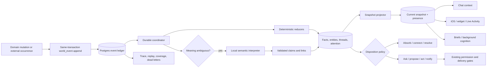

# Sara Continuous World Model — implementation plan

**Date:** 2026-08-28  
**Status:** proposed; repository-audited; no implementation begun by this document  
**Purpose:** make Sara continuously consume what happens in David's world, maintain one durable and current model of it, and let chat, autonomous cognition, widgets, Live Activities, briefs, and background work all act from that same understanding.

## 1. The outcome

Sara should behave as though she has been present for David's day, not as though each surface reconstructs a partial answer when opened.

### 1.1 Always running; the app is a doorway, not a power switch

Sara's backend mind is continuously operating whether every client is open, backgrounded, or terminated. Email/calendar/health/home integrations, durable event processing, temporal transitions, active-thread reviews, background work, consolidation, and warranted cognition continue independently of iOS and web lifecycle.

Opening the app is analogous to David opening Sara's office door:

- it emits a small `app.session.started` presence event indicating that David is nearby and may interact;
- the client reads the already-current snapshot and its revision;
- Sara may surface an already-warranted pending item if the seam-delivery policy says this is a good moment;
- David may chat, log food, record a workout, upload something, or leave without speaking;
- none of those possibilities causes Sara to reconstruct her world merely because the door opened.

App open must never trigger a world-model rebuild, semantic rescan, conversation reconstruction, or artificial cognition turn. A full projection rebuild is an operational recovery/replay tool used after corruption, schema migration, or cache loss—not a user-interface lifecycle behavior. If Redis has restarted, the server recovers its cache from the durable Postgres snapshot independently of whether David opens an app.

“Always running” also does not mean an LLM spins continuously. Sensors, reducers, clocks, queues, and model state remain active continuously; the local model wakes when new meaning, due work, contradiction, reflection, or genuine curiosity warrants it. Sara keeps learning and growing from the event stream and consolidation even when David does not visit a surface.

When an email arrives, a chat turn is stored, a calendar item changes or starts, food is logged, a workout completes, a note changes, a document finishes processing, a location transition occurs, or one of Sara's own tasks changes state, the system must do all of the following:

1. Record the occurrence durably and exactly once at the domain boundary.
2. Apply the deterministic consequences to Sara's current model.
3. Connect the occurrence to known people, projects, commitments, conversations, places, and prior facts when useful.
4. Open, advance, resolve, or invalidate a loop when the occurrence changes one.
5. Decide whether the occurrence only needs to be absorbed, needs semantic interpretation, deserves attention, suggests an action, requires a question, or is important enough to tell David.
6. Make the updated understanding available to the next chat turn and every other presence surface.
7. Retain provenance so Sara can explain why she believes something and retract it when the source changes or is deleted.

The default response to an ordinary event is **quiet absorption**, not a notification. Continuous awareness and continuous interruption are explicitly different systems.

## 2. What is missing today

The repository already contains many of the right nouns, but they are not one dependable nervous system.

### 2.1 Current mechanisms

| Mechanism | Current role | Structural limitation |
|---|---|---|
| `backend/app/services/event_bus.py` | Redis pub/sub for a subset of domain and system events | Publication is best-effort; an event is dropped if Redis is unavailable; pub/sub has no acknowledgement, durable consumer cursor, retry, or crash replay. |
| `backend/app/services/event_envelope_adapter.py` | Converts legacy bus events to `EventEnvelopeV1` | Stores only the latest 500 envelopes per user in Redis for seven days; it is additive and has no authoritative consumers. |
| `event_log` / `backend/app/models/event_log.py` | Persistent-looking generic event table | The normal event bus does not write it. Live on 2026-08-28 it contained 1,075 rows, all eight event kinds were `assistant.*` analytics; it is not a world-event ledger. |
| `event_outbox` / `backend/app/models/event_outbox.py` | Transactional queue for episode/note/document Neo4j synchronization and deep episode analysis | It is specialized to Neo4j jobs and stringified payloads. Live it contained 6,290 completed processing records, primarily `episode_created`; it is not a general event ledger or fan-out runtime. |
| `backend/app/services/unified_context.py` and `context_writer.py` | Flat Redis working-memory snapshot and a 50-item human-readable changes list | It is lossy, Redis-dependent, only selected fields are notable, updates are best-effort, and opening chat clears the change list. |
| `backend/app/services/working_memory.py` | Thin API over the same Redis snapshot | Its source-of-truth claim is not durable: a Redis miss returns an empty snapshot and a periodic DB rebuild only knows selected tables. |
| `backend/app/services/world_model.py` | Read-time foreground/background summary | It queries several source tables independently and silently omits failed slices. It does not persist relationships, event dispositions, or an evolving model. |
| `backend/app/services/context_snapshot.py` and `schemas/contracts.py` | Typed `WorldStateV1`, relationship, self, and body projections | These are useful read contracts, but most slices are assembled from existing tables at request time. They do not solve ingestion or durable state transitions. |
| `backend/app/services/global_workspace.py` | Bounded read model for loops, predictions, concern, work, calendar, and readiness | It advertises seven slots but currently returns six and lacks the active-conversation slot. Each slot is independently best-effort and derived on demand. |
| `backend/app/services/observation_log.py` | Salience queue for deliberation | Observations exist only in Redis for 24 hours. Events below the salience floor are not represented there, and consumed observations lose a durable disposition trail. |
| `backend/app/services/deliberation.py` and `deliberation_gate.py` | Local-model cognition plus action/delivery gates | The prompt gathers many parallel context sources. Outcomes mainly update a few Redis fields, consume observations, and write a journal/run log; they do not reliably mutate a shared world model. |
| `backend/app/services/kernel.py` | Facade for engaged, ambient, focused, and dreaming states | Kernel state has a one-hour Redis TTL; engaged chat is still a shadow path. The facade does not yet make every surface depend on one durable state. |

### 2.2 Producer coverage is incomplete

The `EventType` enum names many desired events, but naming an event does not mean every mutation produces it.

- Chat currently emits `chat.message_received` as a fire-and-forget side effect at **turn start**, before the episode is durably stored, with only a 100-character topic and turn count. The actual episode transaction separately writes the Neo4j outbox.
- Email sync commits new emails and appends a human-readable Redis change such as “N new emails”; it does not create a canonical per-email world event. Read-state changes are also ordinary commits without a world event.
- Calendar route and tool mutations commit directly. The canonical event enum exists, but the audited mutation routes do not use it consistently.
- Notes and documents commit through multiple route and tool paths. Their existing outbox use serves Neo4j, not Sara's awareness.
- Food and selected workout paths do emit legacy events, but emission is fire-and-forget after the domain commit and update/edit coverage is incomplete.
- Location, Home Assistant, presence, interoception, task progress, and some sensory paths emit events, but they inherit the Redis bus's loss and replay limitations.

The result is a system that can reconstruct selected facts if a consumer knows which tables to query, but cannot prove that every meaningful occurrence was noticed, interpreted, connected, or disposed of.

## 3. Architectural decisions

These decisions are the foundation of the implementation.

1. **Postgres is the durable nervous system.** Redis remains a cache and low-latency signal transport, never the only record that something happened.
2. **The domain transaction records the event.** A successful mutation and its `world_event` row commit together. If the mutation rolls back, its event does not exist. If it commits, its event cannot be lost because Redis or Celery was unavailable.
3. **At-least-once processing plus idempotent reducers.** We do not attempt fragile distributed “exactly once” delivery. Unique source identities, reducer watermarks, and processing receipts make repeated delivery produce one state outcome.
4. **Facts and sources remain distinct.** The existing domain tables stay authoritative for raw email, calendar, fitness, document, note, and chat records. The world model stores normalized claims, relations, loops, attention, and source references—not shadow copies of every domain row.
5. **Deterministic before semantic.** Known state changes are reduced without an LLM. A local model is used only for content whose meaning must be extracted or linked.
6. **Absorption precedes expression.** Delivery, quiet-hours, repetition, and permission gates may stop speech or action; they must never prevent the internal model from learning that the event occurred.
7. **One current snapshot, backed by queryable history.** Chat and surfaces get a bounded snapshot and relevant deltas. Detailed questions use provenance-aware retrieval over facts, source records, episodes, and documents.
8. **Every event ends with a disposition.** There must be an inspectable answer to “what did Sara do with this?” even when the answer is “absorbed silently.”
9. **Time passing is an input.** Calendar starts/ends, deadlines, stale expectations, overdue commitments, and expiry transitions are synthesized as events instead of relying on a future request to notice them.
10. **No permanently parallel brain.** Legacy projections remain as compatibility readers during measured shadow periods, then are redirected or deleted after parity.

## 4. Target data flow



Redis may broadcast “new event sequence available” and cache the current snapshot, but replay and recovery always start from Postgres.

## 5. Canonical event contract

Add `EventEnvelopeV2` in `backend/app/schemas/world_events.py`. Keep `EventEnvelopeV1` and its adapter during migration.

Required fields:

| Field | Purpose |
|---|---|
| `event_id` | UUID generated once for this occurrence. |
| `sequence` | Monotonic Postgres sequence used for ordering and consumer watermarks. |
| `schema_version` | Integer payload-contract version for this event kind. |
| `user_id` | Owner whose world model is affected. |
| `kind` | Stable dotted name such as `email.received` or `workout.completed`. |
| `occurred_at` | When the real-world/domain occurrence happened. |
| `observed_at` | When Sara learned about it. |
| `committed_at` | When it entered the ledger. |
| `source` | Stable producer such as `email_sync`, `ios_calendar_sync`, `chat`, or `home_assistant`. |
| `source_ref` | Pointer to the authoritative domain record. |
| `aggregate_type`, `aggregate_id`, `aggregate_version` | Identity and ordering of the affected domain aggregate. Version is nullable until a producer can provide one. |
| `actor_type`, `actor_id` | David, Sara, integration, system, or another person when known. |
| `correlation_id`, `causation_id` | End-to-end trace and direct parent event/turn/task. |
| `dedupe_key` | Stable identity of the source occurrence, not a hash of the whole mutable payload. |
| `payload` | Versioned JSONB containing only the data needed by reducers. Large/sensitive bodies stay in their source tables. |
| `provenance` | JSONB source metadata, import method, extractor version, and upstream IDs. |
| `confidence`, `confidence_basis` | Observed/inferred/confirmed confidence. |
| `sensitivity`, `retention_class` | Access and lifecycle policy. |
| `is_backfill` | Prevents historical imports from causing present-tense outreach or actions. |

Event naming rules:

- Use past tense for occurrences: `email.received`, `note.updated`, `calendar.started`.
- Separate source changes from derived interpretations: `email.received` can cause `world.interpretation.completed`; it must not pretend the extracted commitment was directly observed.
- Deletion events are first-class tombstones.
- Bulk sync completion may have a summary event, but meaningful source records still get stable per-record events.
- Payload versions are per kind. Unknown versions go to a dead letter; they are never guessed through.

Idempotency rules:

- External sync: unique `(user_id, source, kind, source_ref, aggregate_version)` when a version exists.
- Immutable occurrence: unique `(user_id, dedupe_key)`.
- Local mutation: caller-supplied request idempotency key where available; otherwise domain ID plus resulting version/state transition.
- Backfill: `backfill:<source-table>:<primary-key>:<projection-version>`.

## 6. New persistence model

Create the next available Alembic revision after the current head at implementation time. Do not reuse a hard-coded revision number because migrations through `142_departure_brief` already exist in the working tree.

### 6.1 `world_event`

Append-only authoritative ledger.

- UUID primary key plus unique monotonic `sequence BIGSERIAL`.
- Envelope columns listed above; `payload` and `provenance` are JSONB.
- Unique partial indexes for `dedupe_key` and source/version identity.
- Indexes on `(user_id, sequence)`, `(user_id, kind, occurred_at)`, `correlation_id`, `causation_id`, and `(aggregate_type, aggregate_id, aggregate_version)`.
- Application code may append but never update event meaning. Privacy deletion uses payload redaction/tombstones while retaining the minimum audit identity permitted by policy.

### 6.2 `world_event_processing`

Durable coordinator receipt, one row per world event.

- `event_id` unique FK.
- `status`: `pending`, `leased`, `retry`, `completed`, `dead_letter`.
- `attempt_count`, `next_attempt_at`, `leased_until`, `worker_id`, `last_error`, timestamps.
- `reducer_version`, `interpreter_status`, `completed_event_sequence`.
- Claim with `FOR UPDATE SKIP LOCKED`; expired leases are reclaimable.

The ingestion helper inserts `world_event` and `world_event_processing` in the caller's domain transaction. This table—not Redis pub/sub—is the delivery guarantee.

### 6.3 `world_entity`

Canonical identities used across sources.

- Kinds: person, organization, project, topic, place, conversation, document, note, calendar item, task, goal, device, and other only when justified.
- Stable `canonical_key`, display name, aliases JSONB, attributes JSONB, lifecycle status, merge target, first/last source event, timestamps.
- Unique `(user_id, kind, canonical_key)`.
- Entity merge is reversible and retains alias/provenance history.

### 6.4 `world_fact`

Normalized, temporal, provenance-bearing claims.

- Subject entity (nullable only for user/global facts), predicate, either object entity or JSONB scalar/value.
- `valid_from`, `valid_to`, `observed_at`.
- `status`: active, superseded, retracted, disputed.
- Confidence and basis; originating event and source record; extractor/model version when inferred.
- `supersedes_fact_id` and `retracted_by_event_id`.
- Reducer version and last applied event sequence.

Relations such as “Jim works on Risk Ninja” are facts whose object is another entity. This avoids a second competing relation store. Neo4j may remain an eventually-consistent traversal projection, never the only place a relationship exists.

### 6.5 `world_thread`

Durable unfinished business, not just reminders.

- Kinds: commitment, question, follow-up, concern, decision, plan, expectation, and active conversation.
- Status: proposed, open, waiting, blocked, resolved, cancelled, expired.
- Owner, counterparty/entity links, title, next step, due/review times, priority, confidence, source event/fact IDs, correlation ID.
- Legal transitions enforced by one service, borrowing the good pattern in `intent_graph_service.py`.
- Existing reminders, goals, follow-up threads, standing orders, background tasks, and intents remain domain sources during migration; they project into this common thread view.

### 6.6 `world_attention_item`

Sara's inward attention queue. This is deliberately distinct from `outbox_item`, which is outward content for David.

- Source event/fact/thread, domain, description.
- Salience, novelty, urgency, uncertainty, actionability, and aggregate score.
- `coalesce_key`, first/last seen, occurrence count, valid-until.
- Status: queued, leased, reasoning, resolved, deferred, expired.
- Wake budget/cost class and reason.

Low-value events do not need attention rows, but they still update facts/snapshots and receive dispositions. High-volume sources coalesce transitions instead of filling the queue with samples.

### 6.7 `world_event_disposition`

The audit answer to “what did Sara do with this?”

- Unique event ID, processed version, decision timestamp.
- One or more outcomes: `absorbed`, `state_updated`, `connected`, `thread_opened`, `thread_advanced`, `thread_resolved`, `interpretation_queued`, `attention_queued`, `clarification_needed`, `action_proposed`, `action_taken`, `notification_candidate`, `ignored_duplicate`, `retracted`.
- Human-readable reason plus machine-readable state delta and output IDs.
- Policy, model, prompt, and reducer versions.
- Delivery is logged separately through the existing candidate/outbox/notification ledger.

### 6.8 `world_snapshot`

One current materialized snapshot per user, with optional periodic revisions for diagnostics.

- `revision`, `last_event_sequence`, `as_of`, and overall health/coverage.
- Typed slices with independent `updated_at`, source sequence, confidence, and staleness: David now, schedule horizon, people, projects/work, health/fitness, home/location, active conversation, open threads, Sara internal state, and in-flight work.
- `recent_changes` contains bounded structured deltas, not prose cleared when chat opens.
- Redis caches this record by revision; a cache miss reads Postgres.

Add `WorldSnapshotV2`, `WorldSliceV2`, and `ContextBundleV2` contracts. Keep `WorldStateV1` as a compatibility projection until all consumers move.

### 6.9 `sara_presence_snapshot`

One backend-owned view for chat header, widget, Live Activity, web, and diagnostics.

- State: resting, observing, interpreting, deliberating, acting, waiting, engaged, degraded.
- `headline`, optional `detail`, source/correlation/task/event IDs, revision, updated time, and valid-until.
- A stale presence automatically falls back to an honest resting state; it never leaves an old thought displayed forever.
- Ephemeral token/tool progress remains in the active chat stream. Meaningful background state comes from this snapshot.

## 7. Runtime services and exact code layout

Create a focused package rather than continuing to enlarge unrelated modules:

```text
backend/app/schemas/world_events.py
backend/app/schemas/world_snapshot.py
backend/app/models/world_event.py
backend/app/models/world_model.py
backend/app/services/world_state/
  catalog.py
  writer.py
  coordinator.py
  reducer.py
  reducers/
    chat.py
    email.py
    calendar.py
    notes_documents.py
    fitness_health.py
    presence_home.py
    tasks_system.py
  interpreter.py
  entity_resolution.py
  thread_service.py
  attention.py
  disposition.py
  snapshot.py
  context.py
  temporal_events.py
  replay.py
  trace.py
backend/app/tasks/world_state.py
backend/app/routes/world_state_debug.py
backend/tests/world_state/
```

Responsibilities:

- `catalog.py`: event kind, payload schema, reducer version, sensitivity, retention, coalescing, and interpretation policy. An event kind cannot ship without a catalog entry and tests.
- `writer.py`: pure envelope builder plus sync and async SQLAlchemy append helpers. No commits inside the helper.
- `coordinator.py`: leases processing rows, executes reducers, schedules/collects semantic interpretation, commits facts/threads/attention/disposition/snapshot atomically, and updates watermarks.
- Reducers: deterministic, idempotent, replayable functions. No network or model calls.
- `interpreter.py`: local-model structured extraction with strict schemas. Fetches content by source reference and stores no unneeded raw body in events.
- `entity_resolution.py`: exact IDs and known aliases first, embeddings/string similarity second, model judgment last. Low-confidence collisions remain separate or request confirmation.
- `attention.py`: score and coalesce after state reduction so it can measure novelty against the updated model.
- `context.py`: builds the one bounded context bundle used by chat and cognition.
- `temporal_events.py`: emits event-start/end, deadline, expectation, staleness, and expiry transitions.
- `replay.py`: deterministic rebuild into shadow projection versions; never sends, acts, or notifies during replay.
- `trace.py`: causal inspection and “why Sara knows this” provenance.

### 7.1 Processing trigger and recovery

After the domain transaction commits, make a best-effort immediate Celery dispatch to `app.tasks.world_state.process_event`. Also run a frequent recovery drain over pending/retry rows. The immediate signal supplies low latency; the Postgres poll supplies correctness.

Use a dedicated `world_state` queue so deterministic projection is not trapped behind long local-model research. Semantic interpretation may run on the existing local `cognitive`/kernel capacity through `llm_broker`, with its own concurrency limit.

### 7.2 Read-your-writes behavior

`ContextBundleV2` includes a `last_event_sequence` watermark. Before chat context is built:

1. Read the current snapshot.
2. Compare it with the user's latest committed event sequence.
3. If behind, run a bounded inline deterministic catch-up or include the bounded raw deltas above the snapshot watermark.
4. Do not wait for slow semantic interpretation; label not-yet-enriched deltas honestly.

This prevents a just-committed event from being invisible to the next chat turn even if a worker is briefly delayed.

### 7.3 Recursion control

- Reducer state changes are recorded as disposition deltas, not emitted again as identical source events.
- Interpreter completion may create one causally-linked internal event, with maximum causation depth and a distinct kind.
- The catalog declares whether an internal event is reducible, attention-eligible, or trace-only.
- A unique `(causation_id, kind, reducer_version)` guard prevents feedback loops.

## 8. Domain producer integration

Every write path below must call the sync or async world-event writer before its existing commit. Existing legacy bus emission can continue during shadow mode but becomes a compatibility broadcast sourced from the durable ledger, not a second authoritative producer.

| Domain | Existing write paths to cover | Canonical events | Deterministic model effect | Semantic work |
|---|---|---|---|---|
| Chat | `MemoryService.store_episode()` in `main_simple.py`; every alternate conversation persistence path; assistant response completion | `chat.user_turn_stored`, `chat.assistant_turn_stored`, `conversation.created`, `conversation.closed` | Active conversation/thread, last-contact time, recent delta, source episode link | Extract explicit preferences, facts, people/projects, promises, corrections, questions, and topic shifts from substantive turns. |
| Email | `tasks/email_sync.py`; `routes/email.py` read/unread and attachment mutations; analysis completion | `email.received`, `email.updated`, `email.read_state_changed`, `email.analyzed`, `email.attachment_added` | Sender/entity activity, unread/action state, project/thread advancement, recent delta | Extract commitments, dates, decisions, requested actions, project and person links. Re-run when analysis materially changes. |
| Calendar | `routes/calendar_events.py`; `tools/calendar.py`; iOS/bulk sync and any Graph sync path | `calendar.created`, `calendar.updated`, `calendar.cancelled`, `calendar.deleted`, `calendar.started`, `calendar.ended` | Schedule horizon, availability, travel/preparation thread, completed-event transition | Link attendees/projects, infer preparation/follow-up only when supported. |
| Notes | `routes/notes.py`; `tools/notes.py`; note background processors | `note.created`, `note.updated`, `note.deleted`, `note.connected` | Note entity/fact provenance, project/topic links, changed delta | Extract durable claims, decisions, questions, and commitments; retraction on deletion/version replacement. |
| Documents/capture | `routes/documents.py`; `docs_ingest.py`; content inbox extraction; processing completion | `document.uploaded`, `document.processing_completed`, `document.updated`, `document.deleted`, `capture.received` | Document entity, processing state, project/topic relation | Chunk-level extraction and summarization after processing, with page/chunk provenance. |
| Food | `routes/fitness.py` create/update/patch/delete; future photo parser result | `food.logged`, `food.updated`, `food.deleted`, `food.interpretation_completed` | Last meal, daily nutrition totals, training-day context, correction/retraction | Needed only for ambiguous photos/text; deterministic for normalized `FoodItemV2`. |
| Workout | `routes/fitness.py`, `workout_session_service.py`, `workout_v2.py`, watch imports | `workout.started`, `workout.set_logged`, `workout.completed`, `workout.abandoned`, `workout.updated`, `health.workout_imported` | Active session, completed training, load/recovery context, goal/thread progress | Summarize notable progression or deviations; do not model-call every set. |
| Health/recovery | Apple Health sync/import routes and recovery logging | `health.sync_completed`, `health.metric_transitioned`, `recovery.logged`, `sleep.imported` | Current body/recovery slice and expectation comparisons | Interpret cross-domain changes only after deterministic aggregation/baselines. Raw samples are coalesced. |
| Reminders/goals/tasks | Existing reminder/goal tools, `intent_graph_service.py`, background task and agent dispatch transitions | `reminder.*`, `goal.*`, `task.queued`, `task.started`, `task.progressed`, `task.completed`, `task.failed` | Open/resolve common world threads; in-flight work and Sara presence | Summarize results and connect them to originating chat/project. |
| Location/presence | `location_service.py`, presence routes, device presence, app session events | `location.entered`, `location.exited`, `presence.changed`, `app.session.*` | David-now/place/availability; temporal expectation resolution | Usually none. Only anomalous or ambiguous transitions enter attention. |
| Home/sensory | Home Assistant bridge, sensory/vision routes | State-transition events already named in `EventType`, promoted to V2 | Home slice and anomaly state | None for routine changes. Coalesce repeated motion/light/climate observations. |
| Sara/system | Interoception, agent progress, model/queue health, deploy state | `system.health_degraded`, `system.health_recovered`, `sara.task.*`, `sara.capability_changed` | Self/body state, active work, degraded capability | Explain impact and recovery; only high-impact state changes merit outreach. |
| Time | New temporal synthesizer over calendar, threads, expectations, validity windows | `calendar.started/ended`, `thread.due/overdue`, `expectation.violated`, `fact.expired` | Transitions state without waiting for a user request | Interpret only unexpected cross-domain consequences. |

### 8.1 Chat correction

The current `_emit_chat_message_received()` in `chat_turn_notify.py` must stop being the authoritative awareness event because it runs before persistence and may outlive a failed turn. During cutover:

1. Keep its activity/engagement signal as ephemeral presence.
2. Append `chat.user_turn_stored` in the same transaction as the `Episode` and existing Neo4j outbox row.
3. Include the real episode and conversation IDs, complete source kind, content hash, and safe preview—not the full message body.
4. Append `chat.assistant_turn_stored` when the response is durably stored.
5. Have the durable event dispatcher optionally bridge the new event to legacy `CHAT_MESSAGE_RECEIVED` subscribers until they are migrated.

### 8.2 Email correction

Do not represent an email batch only as “N new emails.” Each new/upstream-modified email gets a stable source-referenced event in the same transaction as the email row. The batch summary remains an operational event. Important semantic interpretation occurs after the raw email is committed and may update the model again.

### 8.3 Bulk sync rule

For iOS calendar, health, and other bulk sources, diff against the stored upstream version and emit only created, materially updated, and deleted records. A no-change sync emits at most one trace-level completion event and cannot wake cognition.

### 8.4 App lifecycle rule

`app.session.started`, `app.view.changed`, and `app.session.ended` update presence and delivery opportunity only. They are not ingestion triggers for other domains and cannot invoke snapshot rebuild, memory consolidation, semantic backfill, or a cognition turn by themselves. A pending, independently-created attention item may be reconsidered at app-open as a delivery seam, but the app-open event must not manufacture the item or its message.

## 9. Interpretation and model-building policy

### 9.1 Three processing tiers

| Tier | Cost | Examples | Behavior |
|---|---|---|---|
| Reflex reduction | No model | Read state changed, workout completed, calendar time changed, task failed | Update known fields/facts/threads immediately. |
| Semantic extraction | Local utility/kernel model | New email body, substantive chat turn, note, processed document | Return validated entities, claims, commitments, dates, corrections, and links. No free-form action execution. |
| Deliberation | Local kernel model | Conflicting commitments, meaningful surprise, actionable cross-domain pattern, ambiguity that matters | Decide whether to ask, prepare, act within permission, create a candidate, or defer. |

### 9.2 Structured interpreter output

The interpreter returns a versioned Pydantic object containing:

- entity mentions and proposed canonical links;
- claims with predicate/value, validity, confidence, and exact source span/chunk;
- thread operations (open, advance, resolve, dispute);
- corrections/retractions;
- candidate attention reasons;
- uncertainty and whether confirmation is required.

Invalid output retries once with validation errors, then enters a dead letter. It never writes facts directly; the coordinator validates and applies it idempotently.

### 9.3 Confidence and contradiction

- Direct structured records are `observed`.
- Semantic extraction is `inferred` until corroborated or confirmed.
- David's explicit correction supersedes lower-confidence inferences and records the contradiction edge.
- Conflicting active facts are marked disputed; the system must not silently choose whichever was newest.
- Chat rendering says what Sara knows versus what she is inferring when the distinction matters.

### 9.4 Attention scoring

Score after reduction using:

- novelty relative to active facts and recent events;
- urgency/time-to-consequence;
- importance to active projects/people/threads;
- expectation violation;
- uncertainty that blocks progress;
- actionability and permission;
- David's likely interruptibility;
- repetition and prior dismissal/engagement.

Routine confirmations become silence. Repeated related events coalesce and increase evidence without repeatedly generating prose.

## 10. Cognition and acknowledgement lifecycle

Every event follows this state machine:

```text
committed
  -> deterministically reduced
  -> [optional] semantically interpreted
  -> model/snapshot updated
  -> disposition recorded
  -> [optional] attention queued
  -> [optional] deliberated
  -> [optional] question / proposal / bounded action / notification candidate
  -> resolved, deferred, or waiting with a next-review time
```

The acknowledgement spectrum is:

1. **Absorbed:** model updated; no active loop and no speech.
2. **Connected:** new information linked to existing people/project/topic.
3. **Tracked:** thread opened or advanced; reconsider at a meaningful time.
4. **Clarify:** a question is needed because uncertainty matters.
5. **Prepare:** perform bounded reversible work under current permission rules.
6. **Propose:** ask before a consequential action.
7. **Tell:** create a candidate for the existing Judge→Compose→Review→delivery path.

Delivery rejection changes the outward result, not the event's absorbed/connected/tracked state.

### 10.1 Replace journal-as-state

The Sara journal remains a narrative self-history, not the primary record of cognition. A journal entry is written only when one of these is true:

- the model or an active thread materially changed;
- Sara made a decision or took/proposed an action;
- a contradiction changed her confidence;
- a meaningful new self-understanding was formed.

The journal entry stores related event/fact/thread IDs. Periodic “quiet morning, staying out of the way” paraphrases with no state delta are suppressed by identity/coalescing, not only fuzzy string similarity.

### 10.2 Ambient kernel change

Refactor `kernel.ambient_turn` to read:

- unresolved `world_attention_item` rows;
- world snapshot changes since the last successful ambient turn;
- active threads due for review;
- current self/body state and permission envelope.

Its structured result must include dispositions and explicit state/thread operations. `deliberation_gate.py` applies those through the world-state services before any action or delivery decision. Observations are not considered consumed merely because an LLM call ran; they resolve only when the resulting disposition commits.

When there is no new delta, due thread, curiosity budget, or meaningful internal change, the correct ambient result is no cognition turn and an honest resting presence.

## 11. One context path for chat and background cognition

Add `build_context_bundle_v2(user_id, conversation_id, query)` in `world_state/context.py`.

The bounded bundle contains:

1. Identity, directives, permissions, and voice constraints.
2. Current world snapshot slices with source timestamps and staleness.
3. Active conversation and its durable thread.
4. Recent model deltas since this conversation/user last engaged.
5. Open threads relevant to the query and current moment.
6. Query-specific fact and episodic/document retrieval with provenance.
7. Sara's active work, presence, and capability degradation.

The bundle is token-budgeted by importance and freshness, never by silently dropping a whole failed source. It reports completeness and stale/failed slices so the caller can avoid confident claims.

Cutover order:

1. Generate V2 beside the current `SINGULAR_CONTEXT` path and log semantic diffs.
2. Expose a debug endpoint to compare both bundles.
3. Run shadow responses/evaluations against real recent questions.
4. Switch chat reads behind `WORLD_CONTEXT_READ`.
5. Switch deliberation, briefs, proactive judgment, widget/status, and diagnostics.
6. Remove the old multi-source prompt assembly and make `working_memory.py`, `world_model.py`, and `global_workspace.py` compatibility projections over V2 until their callers are gone.

## 12. iOS, widget, and Live Activity behavior

The continuous model supplies one `sara_presence_snapshot`; surfaces do not invent their own “what Sara is thinking” strings.

- Active chat continues to stream per-turn states such as reading context, searching, calling a named tool, waiting on a tool, composing, and done.
- Background interpretation/cognition/task progress updates the canonical presence row and emits a revision event.
- The iOS app subscribes while foregrounded and falls back to fetch-on-resume.
- Widget timelines read the same App Group snapshot populated from the backend presence endpoint and refresh on meaningful revision changes.
- Live Activity displays meaningful long-running work or a short-lived cognition/action state. It must not be kept alive to show a fake permanent thought.
- Each surface displays `updated_at`; expired content becomes “Available”/resting rather than leaving stale thoughts pinned.
- ActivityKit push delivery can be added for remote background updates, but the backend projection and revision protocol come first so local and remote paths cannot disagree.

The presence text is a projection of real state. It is never generated just to make Sara look busy.

## 13. Privacy, retention, and deletion

1. Events normally contain source IDs, hashes, state deltas, and safe previews. Full email bodies, documents, images, health samples, and chat text stay in their authoritative stores.
2. Interpreters fetch content under the same user authorization and sensitivity policy as the source.
3. Facts inherit the strictest sensitivity of their sources.
4. A source deletion emits a tombstone, retracts dependent facts, removes retrieval content, and rebuilds affected snapshots.
5. Entity/fact provenance lets an account/data deletion find derived records.
6. Backfills never export data or call external models. Local-model policy remains enforced through `llm_broker`.
7. Trace endpoints are owner/debug protected and redact content by default.
8. Retention is explicit per event kind; high-volume operational samples may compact into transitions/aggregates while audit identities remain.

## 14. Observability and operator controls

Add owner/debug endpoints:

- `GET /api/debug/world-state/health` — lag, oldest pending, dead letters, snapshot watermark, interpreter health.
- `GET /api/debug/world-state/events` — filtered event headers and dispositions.
- `GET /api/debug/world-state/trace/{event_id}` — causation tree, reducers, facts, threads, actions, candidates, and errors.
- `GET /api/debug/world-state/snapshot` — current snapshot, revision, per-slice freshness/coverage.
- `GET /api/debug/world-state/coverage` — producer catalog and last-seen event per domain/write path.
- `POST /api/debug/world-state/retry/{event_id}` — safe retry of dead-lettered processing.
- `POST /api/debug/world-state/replay` — explicit dry-run/shadow replay only; live replacement requires a separate confirmation path.

Metrics:

- committed events by kind/domain;
- commit-to-reducer and commit-to-snapshot p50/p95/p99;
- pending/retry/dead-letter counts and oldest age;
- duplicate suppression rate;
- interpreter calls, failures, validation retries, latency, and token use;
- facts created/superseded/retracted/disputed;
- threads opened/advanced/resolved/overdue;
- dispositions by outcome;
- attention coalescing and deliberation wake rate;
- snapshot staleness and context catch-up rate;
- candidate, action, delivery, dismissal, and engagement outcomes;
- surface presence revision lag.

Add a daily coverage assertion: a domain with source changes but no world events is a red health condition, not a silent data gap.

## 15. Feature flags and rollback

Use independent flags, stored through the existing feature-flag mechanism:

- `WORLD_EVENTS_WRITE`
- `WORLD_EVENTS_BRIDGE_LEGACY`
- `WORLD_REDUCERS_SHADOW`
- `WORLD_INTERPRETER`
- `WORLD_CONTEXT_SHADOW`
- `WORLD_CONTEXT_READ`
- `WORLD_COGNITION_READ`
- `WORLD_SURFACES_READ`
- per-domain producer flags such as `WORLD_EVENTS_EMAIL`

Rollback principles:

- Turning off a reader returns that consumer to its legacy projection without deleting the ledger.
- Turning off an interpreter leaves deterministic reductions working and queues/retries semantic jobs later.
- Turning off a domain producer is an emergency measure and must show a coverage alert.
- Events written under a new schema are retained through rollback so replay can resume.
- Do not dual-write indefinitely. Every compatibility path gets a measured exit gate and kill-list entry.

## 16. Implementation phases

### Phase 0 — Contracts, baseline, and source manifest

Deliver:

- Create the event catalog and V2 schemas.
- Create a checked-in producer manifest covering every audited mutation path.
- Record current baselines: event counts, Redis loss behavior, snapshot staleness, chat context sources, journal repetition, and domain write/event parity.
- Add architecture decision records for Postgres authority, facts-versus-source data, and absorption-versus-expression.
- Define sensitivity/retention defaults with explicit overrides for chat, email, documents, location, and health.

Tests/gate:

- Every catalog kind has a payload fixture, reducer/trace policy, retention, sensitivity, and dedupe strategy.
- CI fails for a manifest entry without an integration test.
- No runtime behavior changes.

### Phase 1 — Durable event spine in shadow mode

Deliver:

- Add `world_event`, processing, and disposition tables/models.
- Implement sync/async same-transaction writers, leasing, retry, dead letter, immediate dispatch, recovery drain, trace, and metrics.
- Bridge a processed V2 event to the legacy Redis bus for compatibility.
- Add Redis-down and worker-down recovery diagnostics.

First producers:

- Chat episode persistence and background-task lifecycle, because both already have transactional patterns and immediately prove cross-surface continuity.

Tests/gate:

- Domain rollback produces no event.
- Domain commit produces one event even with Redis and Celery unavailable.
- Duplicate delivery produces one disposition.
- A worker crash after lease is recovered after expiry.
- 10,000 ordered fixture events replay to the same checksums twice.
- No user-facing behavior changes.

### Phase 2 — Deterministic model and snapshot

Deliver:

- Add entity, fact, thread, attention, snapshot, and presence persistence.
- Implement base reducer, transition enforcement, provenance, supersession/retraction, snapshot revision, read-your-writes catch-up, and compatibility projections.
- Map existing intent/reminder/goal/follow-up/background-task sources into `world_thread` without changing their ownership.

Tests/gate:

- Replaying the ledger produces identical facts, threads, dispositions, and snapshot checksum.
- Out-of-order old aggregate versions cannot overwrite newer state.
- Deletes retract dependent facts.
- Redis flush does not erase the model or snapshot.
- Snapshot p95 is within 5 seconds of event commit under ordinary load; next-chat catch-up is immediate and bounded.

### Phase 3 — High-value producer coverage

Wave A:

- Chat user/assistant turns and conversation lifecycle.
- Email received/updated/read/analyzed/attachments.
- Calendar route, tool, iOS sync, create/update/delete.
- Notes route/tool CRUD and connections.
- Document upload/processing/update/delete and content capture.

Wave B:

- Food create/update/delete and interpretation completion.
- Workout session/start/set/completion/abandon/update and imports.
- Recovery/health aggregate transitions.

Wave C:

- Location, presence, Home Assistant, sensory, device, app session.
- Reminders, goals, tasks, autonomy missions, agent progress/results.
- Interoception, capability, model-host, queue, and deployment state.

For each wave:

1. Add same-transaction producers.
2. Run V2 and legacy event paths in shadow.
3. Compare mutation counts to unique event counts.
4. Test create/update/delete and external replay/idempotency.
5. Enable durable-to-legacy bridge.
6. Remove the direct fire-and-forget legacy producer after parity.

Gate:

- 100% of manifest write paths have passing transaction/event integration tests.
- A 24-hour coverage report has no unexplained source changes without events.
- No domain depends on Redis to preserve its occurrence.

### Phase 4 — Semantic interpreter and entity resolution

Deliver:

- Strict local-model extraction for email, chat, notes, and processed documents.
- Entity resolution, source-span provenance, confidence, contradiction, correction, and retraction.
- Interpretation queue isolation, concurrency limit, timeout, retry, dead-letter handling, and model-version recording.
- Content-change hashes prevent reinterpreting unchanged source text.

Gate:

- Curated fixtures meet agreed precision for people/project/date/commitment extraction.
- No invalid model output mutates facts.
- Duplicate interpretation produces no duplicate facts/threads.
- David's correction reliably supersedes inference.
- Sensitive raw content is absent from ordinary event/trace payloads.

### Phase 5 — Temporal awareness and cross-domain loops

Deliver:

- Calendar start/end, deadline, expiry, overdue, expectation, and staleness synthesizer.
- Cross-domain thread rules: email commitment ↔ calendar date; workout plan ↔ completed workout; document/note ↔ project; task result ↔ originating chat; event ended ↔ follow-up opportunity.
- Coalescing and transition rules for health/home/high-volume signals.

Gate:

- Temporal fixture clock advances deterministically through starts, ends, due, overdue, and expiry.
- Routine high-volume data cannot flood attention or model calls.
- Cross-domain links always retain both source provenances and confidence.

### Phase 6 — Context cutover

Deliver:

- `ContextBundleV2`, completeness metadata, relevance retrieval, bounded deltas, and watermark catch-up.
- Shadow comparison in live chat.
- Switch chat, then deliberation, then briefs/proactive judgment to the V2 bundle.
- Turn current `working_memory`, `world_model`, and `global_workspace` APIs into compatibility projections.

Gate:

- Scenario evaluations show the V2 response sees every just-committed relevant event.
- No context source silently disappears; missing/stale coverage is explicit.
- Context stays within its token budget and does not regress first-token latency materially.
- “Why do you think that?” can resolve a statement to source events/records.

### Phase 7 — Cognition, dispositions, and action feedback

Deliver:

- Replace Redis observations as the authoritative attention queue.
- Refactor ambient deliberation to read world deltas/threads and commit dispositions/state operations atomically.
- Feed task/action/delivery outcomes back as causal events.
- Add identity-based repetition suppression and journal state-delta requirements.
- Preserve current permission, hard-block, quiet-hours, judge/compose/review, and notification delivery systems.

Gate:

- Every processed event has a terminal or waiting disposition.
- A failed/rejected action remains visible and can advance or block its originating thread.
- Suppressed delivery does not suppress model update.
- Repeated quiet periods produce no paraphrased thought loop.
- No cognition event can recursively wake itself without a new delta or scheduled review.

### Phase 8 — Presence surfaces

Deliver:

- Backend presence snapshot/revision endpoint and event stream.
- Chat header, iOS foreground subscription, widget cache refresh, and Live Activity consumer migration.
- Honest expiry/fallback states and task/correlation deep links.
- ActivityKit remote update path only after projection parity.

Gate:

- Chat, iOS status, widget, Live Activity, and debug endpoint show the same revision/content.
- Background task/cognition changes appear within the delivery target when iOS is foregrounded.
- Expired content clears automatically.
- No surface manufactures a thought or displays one after its valid-until.

### Phase 9 — Backfill, ownership cutover, and deletion

Deliver:

- Backfill domain records as `is_backfill=true` imported events into an isolated projection version.
- Backfill recent high-value history first: active threads, future/recent calendar, unread/action email, active projects/notes/docs, recent chat facts, current fitness/health, active tasks.
- Compare shadow/current outputs and promote a snapshot version atomically.
- Freeze and delete obsolete writers/readers only after measured parity.

Backfill safety:

- No notification, external action, present-tense journal entry, or attention wake from imported history.
- Preserve original occurrence times and source IDs.
- Do not turn every historical chat sentence into a fact. Apply the same semantic/confidence policy with tighter thresholds.

Retirement candidates after cutover:

- Redis-only envelope storage as authority; retain only an optional short cache.
- Redis observation log as authority.
- Human-readable `changes_since_last_chat` clearing behavior.
- Direct mutation-to-legacy-bus fire-and-forget calls.
- Legacy read-time world/context assemblies once no consumer uses them.
- Separate ACS external-event post for chat if ACS reads the canonical ledger.
- Any journal/watch/focus field that duplicates facts, threads, attention, or presence.

The Neo4j `event_outbox` remains until its own processing is migrated to consume the durable world ledger; do not combine that migration with the initial nervous-system cutover.

## 17. Required end-to-end scenarios

These are release tests, not illustrative aspirations.

### Scenario A — email quietly becomes context

An email from Jim says Thursday works for the Risk Ninja walkthrough and asks about pricing.

Expected trace:

1. Email row and `email.received` commit together.
2. Reducer updates Jim's recent interaction and unread/action state.
3. Interpreter links Jim, Risk Ninja, Thursday, walkthrough, and pricing; it advances or opens one project thread.
4. Snapshot revision changes.
5. Disposition is connected/tracked; no notification unless urgency/importance policy justifies one.
6. The next chat can naturally mention the update and cite the email.

### Scenario B — a chat fact survives navigation and time

David says that a family appointment moved to Tuesday, then leaves the chat.

Expected trace:

- The stored episode and event share a transaction.
- The active conversation persists independently of the screen.
- The interpreter extracts the changed date with source provenance and checks relevant calendar/thread conflicts.
- Returning through any device sees the same conversation and updated world context.
- If ambiguous, Sara tracks a clarification rather than silently inventing a calendar edit.

### Scenario C — calendar passage advances state

A meeting starts and ends without David opening the app.

Expected trace:

- Temporal events start/end the calendar state.
- Presence/availability updates.
- A due preparation thread resolves or becomes missed based on evidence.
- A follow-up opportunity may enter attention; it does not automatically nag.

### Scenario D — food and workout change the day model

David logs lunch and later completes a workout.

Expected trace:

- Nutrition and active training slices update deterministically without an LLM per item/set.
- Workout completion advances the relevant training thread and changes recovery context.
- The next chat/brief sees both and does not ask whether he ate or trained.

### Scenario E — document/note becomes project knowledge

A document is uploaded and a related note is edited.

Expected trace:

- Upload is known immediately; semantic claims wait for processing completion.
- Extracted claims retain page/chunk provenance.
- The note and document link to the existing project when confidence is sufficient.
- Deleting either source retracts only facts dependent on it; corroborated facts remain with surviving provenance.

### Scenario F — infrastructure outage

Redis and the world-state worker are stopped while a domain mutation succeeds.

Expected trace:

- The event remains pending in Postgres.
- The domain request succeeds normally.
- Recovery processes the event once services return.
- Snapshot catches up without duplicates; lag was visible as degraded health.

### Scenario G — repeated gym-bag-type signal

The same underlying reminder/condition is observed repeatedly.

Expected trace:

- One thread/attention item is updated by coalesce key.
- Prior delivery/dismissal feedback affects expression policy.
- No repeated notification is generated unless the underlying state or urgency materially changes.
- The trace explains the suppression.

## 18. Test strategy

### Unit

- Envelope validation/versioning/dedupe.
- Reducer idempotency and out-of-order protection.
- Fact supersession/retraction/contradiction.
- Entity merge/unmerge.
- Legal thread transitions.
- Attention scoring/coalescing/expiry.
- Disposition completeness.
- Snapshot checksum and slice freshness.
- Interpreter schema validation and source-span enforcement.

### Transaction integration

- Sync and async SQLAlchemy commit/rollback.
- Domain row plus event atomicity for every producer manifest entry.
- Existing outbox plus world event in the same chat/note/document transaction.
- Bulk sync diff/idempotency.
- Delete cascades/retractions.

### Worker and chaos

- Redis down, broker down, worker down, model host down, DB lease expiry, process crash after reduce/before commit, duplicate Celery delivery.
- Backlog drain and concurrency ordering.
- Poison event dead-letter with later safe retry.
- High-volume health/home load and attention coalescing.

### Context/evaluation

- Golden context fixtures for each end-to-end scenario.
- “Knows it,” “does not overclaim it,” “can cite it,” and “forgets/retracts it” assertions.
- Token budget, context-build latency, snapshot lag, and first-token regression checks.
- Compare V1/V2 bundle answers over a curated sample of recent real questions with content redacted from test artifacts.

### iOS/surface

- Presence revision parsing and stale expiry.
- Foreground event-stream reconnect and fetch-on-resume.
- Widget App Group refresh.
- Live Activity revision/order/expiry behavior.
- Same snapshot revision across backend, chat header, app, widget, and activity.

## 19. Service-level objectives

- Event durability: 100% of successful covered mutations have one durable event.
- Deterministic projection: p95 under 5 seconds from commit; p99 under 15 seconds under normal load.
- Next-turn awareness: read-your-writes on the next chat context build regardless of worker lag.
- Semantic enrichment: p95 under 2 minutes when the local model is healthy; backlog is visible and does not block deterministic knowledge.
- Recovery: no event loss across Redis/Celery/backend restart; expired leases reclaimed automatically.
- Disposition completeness: 100% of completed processing rows have a disposition.
- Provenance: every inferred active fact points to at least one source record/event and extractor version.
- Surface freshness: one presence revision across surfaces; stale text expires by its declared valid-until.
- Notification quality: awareness coverage may increase without an increase in repeated-topic notifications; coalesced/suppressed reasons remain inspectable.

## 20. Definition of done

This concept is alive only when all of the following are true:

1. Every meaningful in-scope domain mutation is transactionally represented in the durable ledger.
2. Postgres can rebuild Sara's model after Redis is erased.
3. Every event has a traceable disposition.
4. Chat, ambient cognition, briefs, widget, Live Activity, and diagnostics read the same snapshot contract.
5. Sara can connect new information to people, projects, commitments, and prior conversations with provenance and confidence.
6. Time transitions occur while no client is open.
7. Corrections and deletions supersede/retract derived beliefs.
8. The next chat sees just-committed relevant events even during worker lag.
9. Low-value events are quietly absorbed; model use is selective and measurable.
10. Action and delivery outcomes feed back into the originating thread instead of disappearing into separate logs.
11. Repetitive internal monologues and notifications are blocked by event/thread identity and outcome feedback, not wording similarity alone.
12. Legacy parallel event, observation, context, and presence paths have either been deleted or are explicitly documented compatibility adapters with an exit date/gate.

## 21. Recommended execution order

The shortest safe path to a visibly better Sara is:

1. Durable event spine and trace.
2. Chat + task lifecycle producers.
3. Facts/threads/snapshot and read-your-writes.
4. Email + calendar producers and semantic extraction.
5. Context V2 shadow and chat cutover.
6. Notes/documents, then food/workout/health.
7. Temporal and cross-domain reasoning.
8. Ambient cognition/disposition cutover.
9. Presence/widget/Live Activity cutover.
10. Backfill, parity window, and deletion of legacy paths.

This order proves continuity in chat early, then adds the two domains with the highest assistant value, and only later changes autonomous expression. It keeps the riskiest part—what Sara decides to say or do—behind a fully observable world model rather than trying to improve judgment while its inputs are still incomplete.
